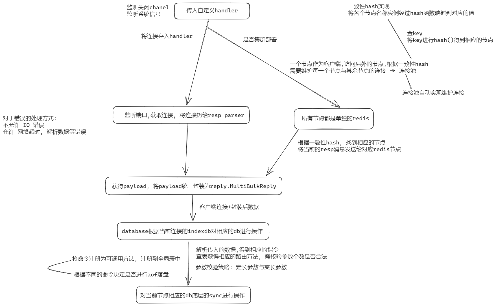

## go-redis

### 基于 Redis serialize protocol tcp报文传输协议, 实现的 GoLang 版本 Redis

### Go实现Redis中间件

> 项目内技术栈: 
> 
>> cluster: 连通redis集群的抽象层
> 
>> database: 管理单个节点下的所有DB
> 
>> aof落盘: 监听必要落盘指令
> 
>> 单个DB: sync.Map的上层封装
> 
>> 底层数据结构: sync.Map

流程图:

_img made by excalidraw+: https://excalidraw.com/#json=jjrNEAqdcgsgpZz1ZX3x7,eNT54L_saDI44l6y5k8IjA_

### Redis网络协议

#### RESP

#### 正常回复

以“+” 开头，以“\r\n”结尾的字符串形式，例如 `+OK\r\n`

#### 错误回复

以“-” 开头，以“\r\n”结尾的字符串形式，例如 `-Error message\r\n`

#### 整数

以“:”开头，以“\r\n”结尾的字符串形式，例如 `:123456\r\n`

#### 多行字符串

以“$”开头，后跟实际发送的字节数，以“\r\n”结尾。  
例如 `$9\r\nimooc.com\r\n` 等于 `"imooc.com"`  
例如 `$0\r\n\r\n` 等于 ""

#### 数组

以“*”开头，后跟成员个数 